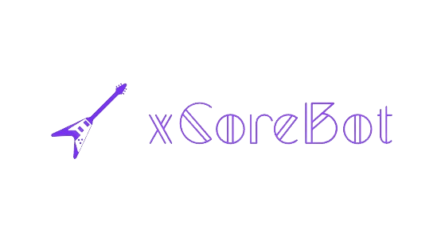
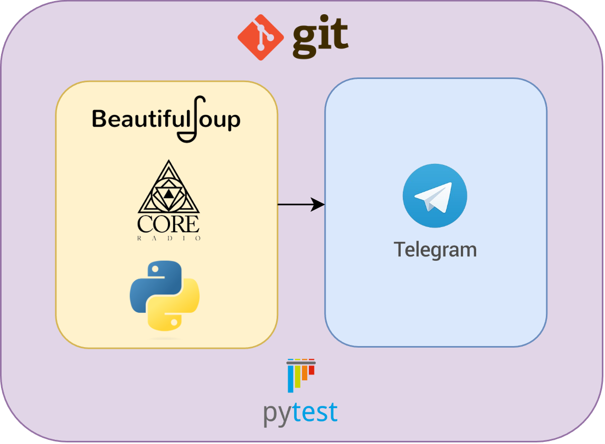

# xCoreBot



Developed by **Antonio Finocchiaro** and **Salvatore Alfio Sambataro**, this project is part of the **Quality Development** course at the University of Catania.

## Project Goal
This project involves the creation of a Telegram Bot aimed at delivering users the most recent music releases from the metal music scene.
Users have the option to access this information using two distinct commands.
They can choose to retrieve all the latest releases or specify a subset based on their preferences.

## Technologies used
<ul>
<li> <strong>Web Scraping</strong>: <a href="https://www.crummy.com/software/BeautifulSoup/bs4/doc/">BeautifulSoup</a>
<li> <strong>Parallel Tasks</strong>: <a href="https://docs.python.org/3/library/concurrent.futures.html">Concurrent Futures</a></li>
<li> <strong>Telegram API</strong>: <a href="https://core.telegram.org/bots/api">Telegram</a></li>
</ul>

## Project Structure


## How to execute the project
In order to execute the Telegram Bot, you need to follow some steps.
### Install requirements
Install the libraries needed first.
Use pip or pip3 to install the dev requirements for the software usage and testing:

```bash
pip3 install -r ./src/requirements.txt
pip3 install -r ./tests/requirements.txt
```

### Start project
Execute <code>python3 coreRadioBot.py</code> in the /src folder.

### Software Testing

Run the following command in the main directory to obtain a html report about the Pytest Coverage

```bash
$ pytest --cov ./src ./tests --cov-report=html
```
